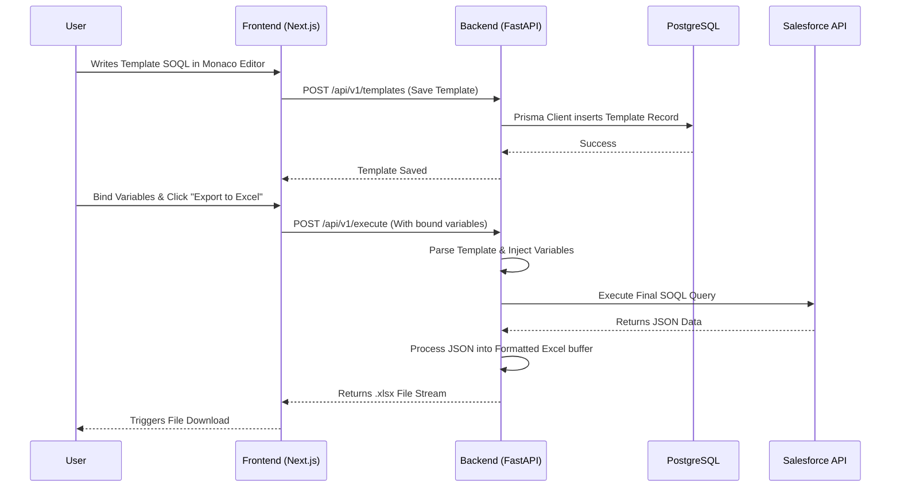

<div align="center">

<!-- Animated Header Image / Banner (SVG animation) -->
<a href="https://github.com/AbhishekDas">
  
</a>

<br/>

[](https://git.io/typing-svg)

<br/>

**The Ultimate Solution for Salesforce SOQL Operations & Excel Reporting Automation**

[](https://nextjs.org/)
[](https://fastapi.tiangolo.com/)
[](https://www.prisma.io/)
[](https://www.postgresql.org/)
[](https://www.typescriptlang.org/)
[](https://tailwindcss.com/)

[Explore Docs](#) · [Report Bug](#) · [Request Feature](#)

</div>

---

## 📖 Table of Contents

- [Overview](#-overview)
- [Deep Dive: Core Components](#-deep-dive-core-components)
  - [Frontend Ecosystem](#1-frontend-ecosystem-nextjs)
  - [Backend Ecosystem](#2-backend-ecosystem-fastapi)
  - [Database & ORM](#3-database--orm)
- [Architecture Flow](#-architecture-flow)
- [Project Structure](#-project-structure)
- [Getting Started](#-getting-started)
- [Future Roadmap](#-future-roadmap)
- [Author](#-author)

---

## 🚀 Overview

**Meghdoot** is an enterprise-grade web application engineered to solve complex Salesforce data extraction and reporting challenges. By combining a highly responsive frontend with a blazing-fast Python backend, Meghdoot allows users to:
1. Write dynamic **SOQL queries** with template variables.
2. Bind these variables visually.
3. Automatically execute and map the results into **complex Excel files** with one click.

<div align="center">
  
  <br/>
  <i>(Real-time SOQL parsing & dynamic variable mapping in action)</i>
</div>

---

## 🧩 Deep Dive: Core Components

Here is a detailed breakdown of how each component within Meghdoot is orchestrated to deliver a seamless experience.

### 1. Frontend Ecosystem (Next.js)
The client-side application is designed for absolute performance and developer experience.
* ⚛️ **Next.js 15+ (App Router):** Utilizes server-side rendering (SSR) and optimized routing for lightning-fast page loads.
* 🎨 **Tailwind CSS & Radix UI:** A meticulously crafted, accessible, and highly customizable UI component system. Unstyled Radix primitives provide the accessibility layer (Dialogs, Dropdowns, Tooltips), while Tailwind handles the visual polish.
* 🧠 **Zustand & React Query:** 
  * `Zustand` manages global UI state (like active editor themes and user preferences) without boilerplate.
  * `React Query (@tanstack/react-query)` handles robust server-state management, caching, and background data fetching for API endpoints.
* 📝 **Monaco Editor:** Integrates the VS Code engine directly into the browser, providing syntax highlighting, autocomplete, and a premium code-editing feel for SOQL templates.
* 📈 **Recharts:** Renders dynamic, responsive data visualizations and dashboards directly in the browser.

### 2. Backend Ecosystem (FastAPI)
The backend is a high-performance RESTful API built to handle heavy data processing.
* 🐍 **FastAPI:** Built on Starlette and Pydantic, it provides automatic interactive API documentation (Swagger UI/ReDoc) and incredible async performance.
* ⚙️ **Uvicorn:** A lightning-fast ASGI server implementation used to run the FastAPI application.
* 🛠️ **SOQL Engine:** A custom-built parser that processes template tags within SOQL strings, safely injects user-bound variables, and validates queries before hitting the Salesforce API.
* 📊 **Excel Automation Layer:** Processes raw relational JSON data from Salesforce and maps it dynamically into highly formatted `.xlsx` files using specialized Python libraries.

### 3. Database & ORM
Data persistence is handled with safety and scalability in mind.
* 🐘 **PostgreSQL:** The world's most advanced open-source relational database, ensuring ACID compliance and robust relational data storage.
* ⬡ **Prisma ORM (`@prisma/client` & `@prisma/adapter-pg`):** Provides type-safe database access. It auto-generates TypeScript types based on the schema, ensuring that database queries in Next.js API routes (or backend syncs) are strictly typed and error-free.

---

## 🏗 Architecture Flow



---

## 🗂️ Project Structure

```text
MeghdootPlayground/
├── backend/                   # FastAPI Python Server
│   ├── app/                   # Core application logic
│   │   ├── api/               # REST API Routes
│   │   ├── core/              # Config, Database setup, Security
│   │   └── main.py            # FastAPI Entry Point
│   └── requirements.txt       # Python dependencies
├── frontend/                  # Next.js React Client
│   ├── app/                   # Next.js App Router (Pages & Layouts)
│   ├── components/            # Reusable UI components (Radix + Tailwind)
│   ├── lib/                   # Utility functions & helpers
│   ├── prisma/                # Database schema & migrations
│   ├── public/                # Static assets
│   ├── store/                 # Zustand state management
│   ├── package.json           # Node dependencies
│   └── tailwind.config.ts     # Tailwind design system tokens
└── README.md                  # Project Documentation
```

---

## 🏁 Getting Started

Follow these precise steps to spin up the entire Meghdoot stack locally.

### 1. Prerequisites
Ensure your development environment meets these requirements:
* **Node.js** v18.0.0 or higher
* **Python** v3.10 or higher
* **PostgreSQL** v14+ running locally or in Docker

### 2. Repository Setup
```bash
git clone https://github.com/AbhishekDas/meghdoot.git
cd meghdoot
```

### 3. Frontend Initialization
```bash
# Install Node modules
npm install

# Setup Prisma and push schema to database
npm run prisma:generate
npx prisma db push
```

### 4. Backend Initialization
```bash
cd backend

# Create & activate a virtual environment
python -m venv venv
source venv/bin/activate  # Windows: venv\Scripts\activate

# Install Python requirements
pip install -r requirements.txt
```

### 5. Launch Development Servers
You will need two terminal windows to run both services simultaneously:

**Terminal 1 (Root Directory):**
```bash
# Starts Next.js on http://localhost:3000
npm run dev
```

**Terminal 2 (Root Directory):**
```bash
# Starts FastAPI on http://localhost:8000
npm run backend:dev
```

---

## 🌟 Future Roadmap

- [ ] **AI-Powered Query Suggestions:** Integrate LLMs to help users write SOQL faster.
- [ ] **Automated Email Reports:** Schedule and dispatch Excel reports directly to stakeholders.
- [ ] **Multi-Tenant Support:** Allow distinct organizations to have isolated workspaces.

---

<div align="center">
  
  
  <h3>Built with ❤️ and ☕ by <b>Abhishek Das</b></h3>
  <p>
    <a href="https://github.com/AbhishekDas">
      
    </a>
  </p>
</div>
